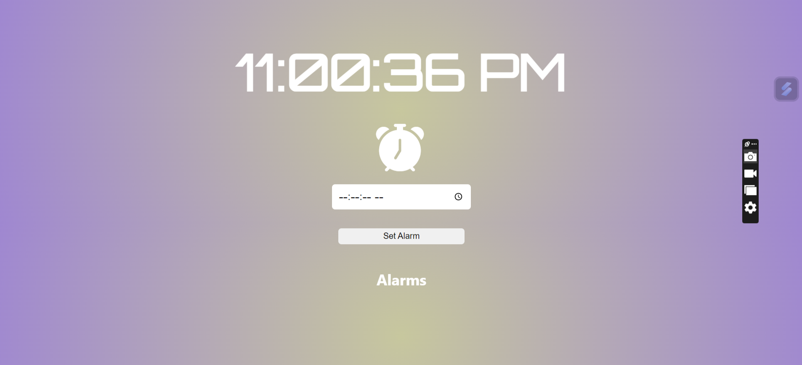
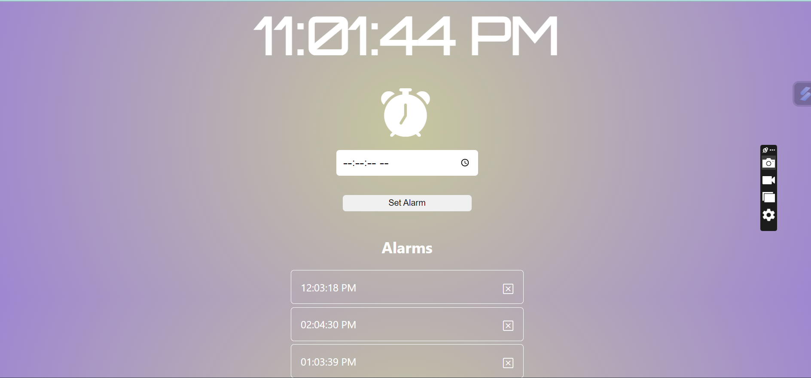

# alarm-clock
Alarm Clock application developed as part of the Frontend Skill Test for Coding Ninjas.

The code creates an interactive alarm clock application that allows users to set alarms, receive notifications, and manage their alarms visually. The combination of JavaScript, HTML, and CSS results in a user-friendly and visually appealing alarm clock experience.

### Hosted link: [alarm-clock](https://mouup.github.io/alarm-clock/)

## Features
- Display of digital clock
- Set Alarms 
- Add alarms to a List of Alarms
- Delete alarms from the List

